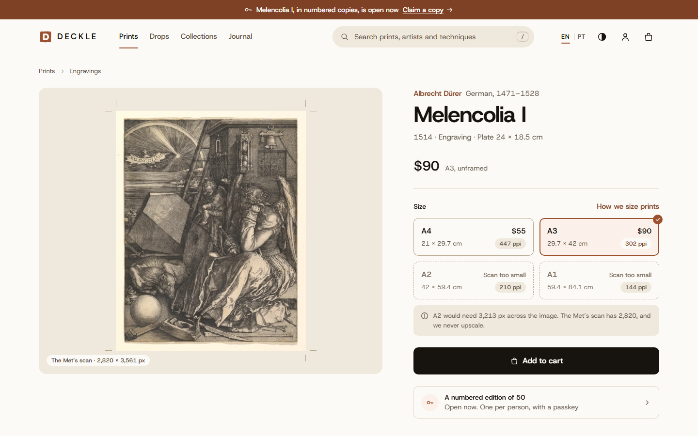
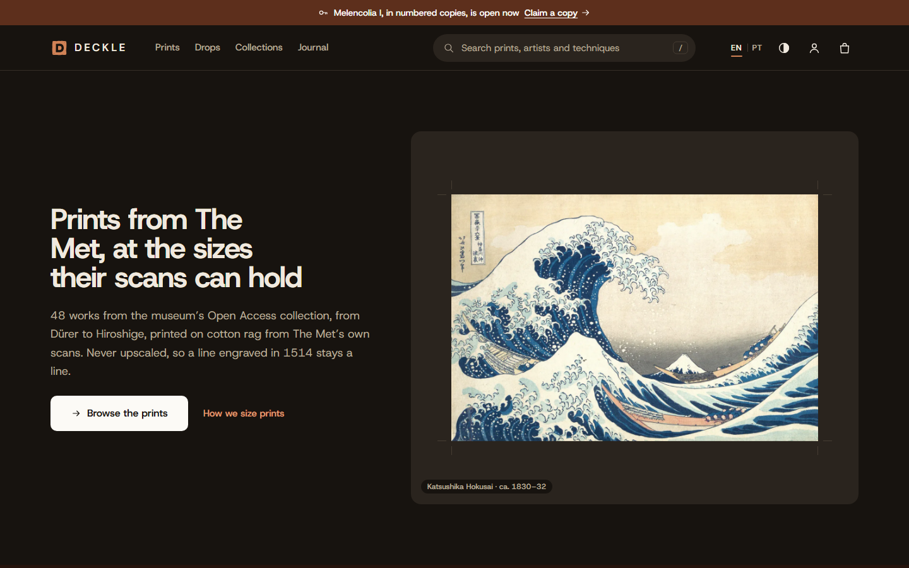
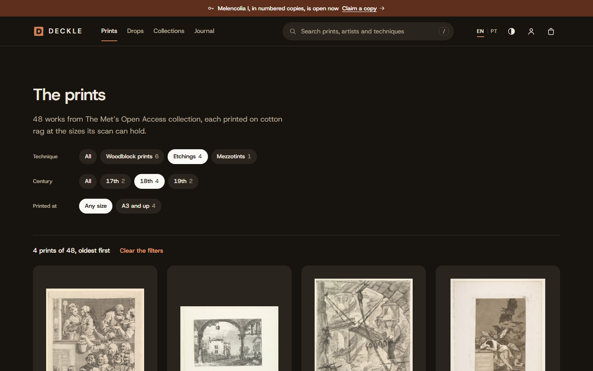
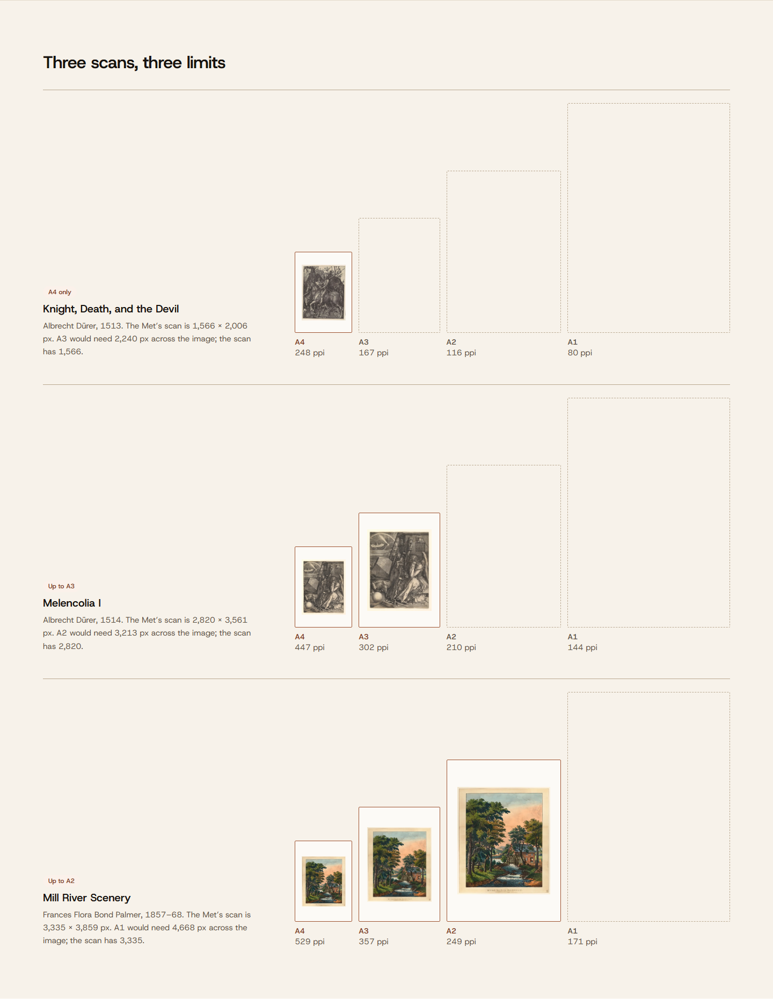
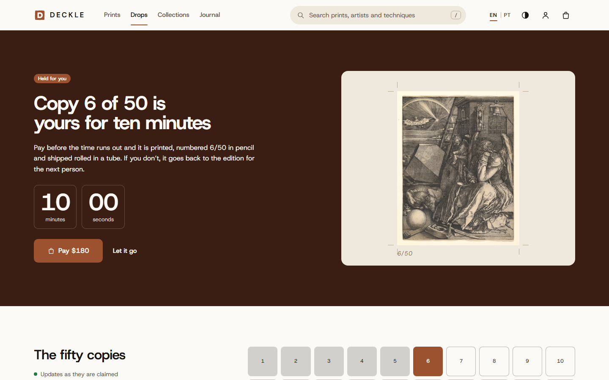
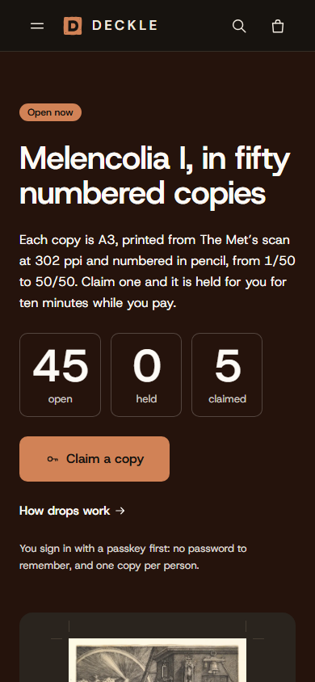
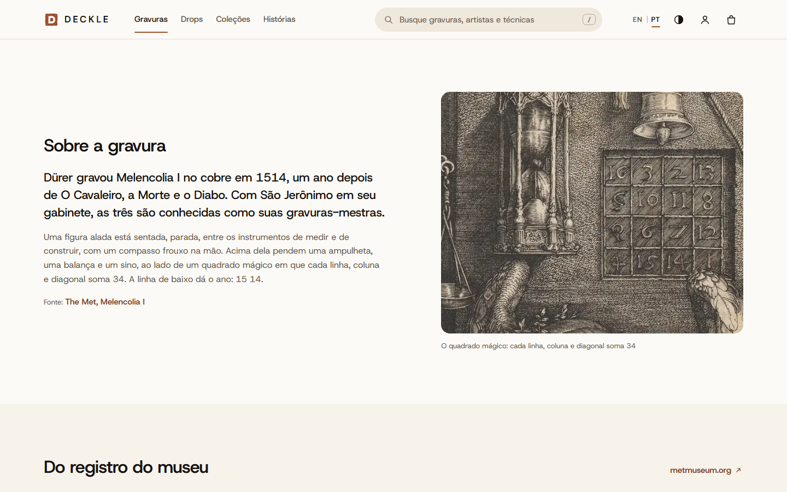
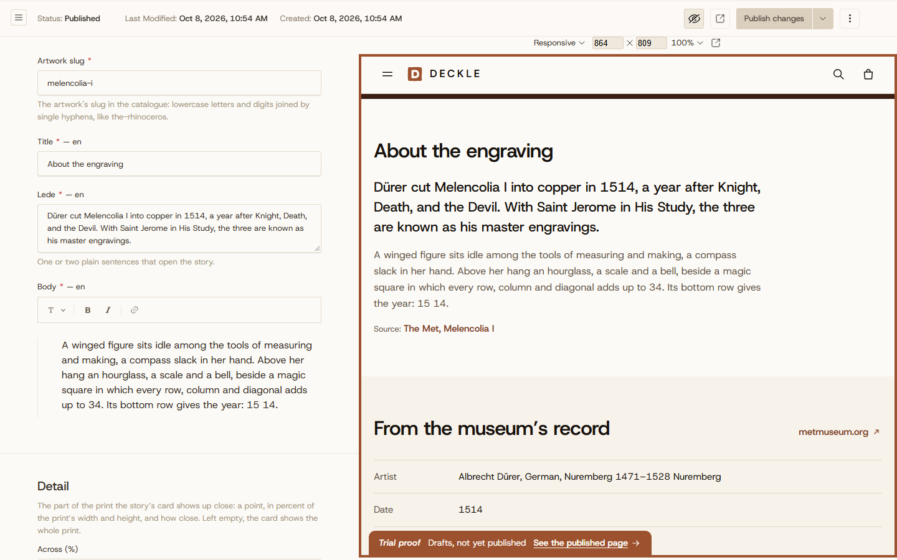
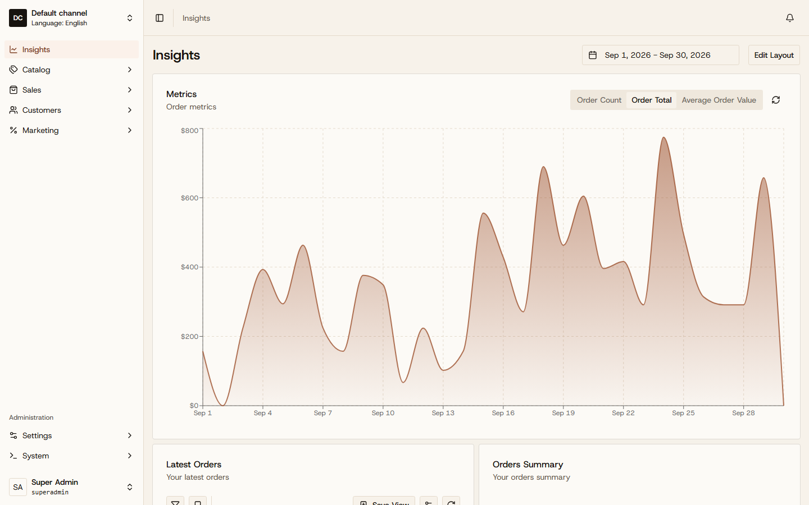
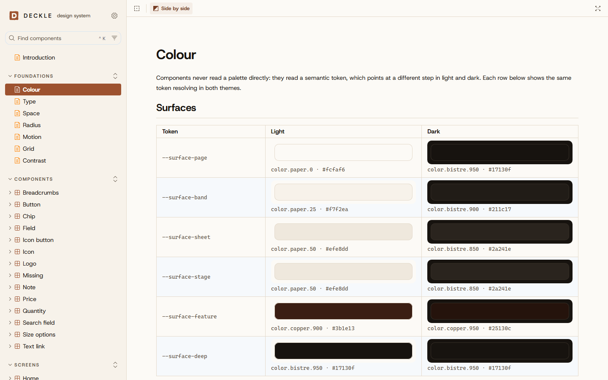

# Deckle

A headless print shop for public-domain works from [The Met's Open Access collection](https://www.metmuseum.org/about-the-met/policies-and-documents/open-access), with numbered editions that never oversell.

Browse 48 prints by technique, century and size, each offered only in the paper sizes its scan can hold at 240 ppi, and buy one as a guest, with no account. Or claim a copy in a drop: fifty numbered copies of one print, released at a set hour, one per passkey, held for ten minutes while you pay and counted live for everyone watching. Behind the shop, an editor writes each work's story in Payload and previews the draft on the store before it goes out, and every order lands in Vendure's dashboard.

In English, and in Brazilian Portuguese under `/pt-br`.

Next.js 16, React 19.3, styled-components and Apollo Client 4 in front, a NestJS 12 GraphQL gateway in the middle, Vendure 3.7 and Payload 3 behind it, all on Postgres 18.



<details>
<summary>More screens</summary>

**The front page, in the dark theme**



**The prints, narrowed to 18th-century etchings**



**How large a print can be**



**A numbered copy, claimed with a passkey and held**



**The open drop on a phone, in the dark theme**



**A work's story in Brazilian Portuguese**



**A draft in Payload, previewed on the store**



**Vendure's dashboard in Deckle's brand**



**The design system in Storybook**



Regenerate with `pnpm run screenshots`, against the stack `docker compose up --wait` started, or with `pnpm run screenshots <name>` for one screen. Whatever a screen changes, such as a held copy or the dashboard's language, it puts back.

</details>

---

## Setup

Docker, and nothing else. No API key or account.

```bash
docker compose up --wait
```

That pulls the images CI publishes; add `--build` to build them from the checkout instead. Then:

| Where | What |
| --- | --- |
| `http://localhost:8080` | The store, and the same store in Brazilian Portuguese under `/pt-br` |
| `http://localhost:8080/graphql` | The gateway: the only API the browser will ever see |
| `http://localhost:8081/admin` | Payload, for stories, curations and drop pages: `editor@deckle.localhost`, `deckle-editor` |
| `http://localhost:8082/dashboard` | Vendure's dashboard: `superadmin`, `deckle-superadmin` |
| `http://localhost:8083` | Storybook: the design system's foundations, its components and the screens the store was built from |
| `http://localhost:8025` | Mailpit, where every receipt lands |

The shop starts with two months of trade, so the dashboard has something to show: about 150 orders from 40 invented customers at `example.com`, placed through Vendure's own checkout and dated back, some still to ship, most delivered, a few cancelled and refunded. `DECKLE_DEMO_DATA=false docker compose up --wait` leaves them out. Payload starts with five curations, twelve short stories and two drop pages, every fact in them from The Met's record of the work.

One drop opens with the stack, and the next counts down to its hour, eight days on. A copy is claimed with a passkey, which any current browser can make for `localhost`, and checkout takes a test payment: nothing is charged and nothing ships.

```bash
curl -s http://localhost:8080/graphql -H 'content-type: application/json' \
  -d '{"query":"{ artwork(slug: \"melencolia-i\") { title sizes { size available ppi } story { title } } }"}'
```

To work on it: pnpm 11 or newer, which switches itself to the pinned 12.9.1 and downloads Node 24.21 on the first `pnpm install`.

---

## Why this data set

The Met marks each record public domain or not, and its Open Access images are CC0, downloadable in full without a key. Its API does not say how large an image is, so the importer reads the size from each file's own header.

That size decides what can be sold. Dürer's _Melencolia I_ is a 2,820 × 3,561 px scan: 447 ppi at A4, 302 at A3, and 210 at A2, below the floor, so A2 is not offered. None of the 48 works reaches A1, which needs at least 4,668 px on a side: no original The Met serves for them is over 4,000.

---

## Screens

| Route | What it is |
| --- | --- |
| `/` | Front page: the open drop, a few prints, how large a print can be, the collections and the latest stories |
| `/prints` | Every print, oldest first, narrowed by technique, century and size |
| `/prints/:slug` | One work: the sizes its scan can hold, its story, and the museum's record |
| `/collections` | The curations editors put together in Payload |
| `/collections/:slug` | One curation: its introduction and its works |
| `/journal` | The stories, each read beside its print on the work's page |
| `/search` | A search that forgives a typo, and suggests artists, techniques and works as you type |
| `/about/sizes` | How the sizes are decided, shown on three scans |
| `/drops` | The drops, open and to come, each with its hour |
| `/drops/:slug` | One drop: its copies, counted live, and a claim that holds one for ten minutes |
| `/about/drops` | How a drop works, from the passkey to the copy numbered in pencil |
| `/cart` | The cart, kept for a guest |
| `/checkout` | One page: contact, address and a test payment |
| `/orders/:code` | An order, as placed |
| `/account` | Signing in with a passkey, and the copies held or paid for |

Each one is also under `/pt-br`, in Brazilian Portuguese.

---

## How it is built

- **Buy the platforms, build the drop.** Vendure runs the catalogue, cart and checkout; Payload runs the editorial. Code of our own exists only where neither helps.
- **One origin.** Caddy serves the store, GraphQL over HTTP and WebSocket, and the images, so there is no CORS and every cookie is first-party.
- **The gateway owns the contract.** Its code-first schema is committed, and CI fails on a stale file or a change that would break a client. Swapping Vendure for Shopify Plus would be an adapter in the gateway, not a rewrite.
- **A passkey is the whole account.** No name, email or password: the gateway checks passkeys with SimpleWebAuthn, keeps each browser's session behind an `httpOnly` cookie, and vouches for its users to Vendure with short-lived EdDSA tokens whose keys it publishes, so commerce holds no secret that could mint a login.
- **A drop never sells a fifty-first copy.** Each drop is fifty rows. A claim takes the lowest open one under `FOR UPDATE SKIP LOCKED`, so claims made at once each get a different copy and none waits; partial unique indexes hold each person to one, and commerce's stock would refuse a fifty-first if the database ever let one through. A k6 test on every push has a thousand people, each with a passkey made in software, claim in the same second through two gateways.
- **Changes arrive signed and once.** Vendure and Payload post HMAC-signed webhooks, deduplicated in the same transaction as their effect, and the gateway turns each one into cache tags and a live GraphQL event.
- **Pages come from the cache until they would be wrong.** The store renders on the server from reads tagged with the same words the gateway drops, so a new price shows on the next request, with no timer to wait out. Nothing reads at build time, so the image builds without a stack.
- **What is everyone's renders on the server; what is yours, in the browser.** The prints and the drops are cached server renders. The cart, a held copy and the account are read by Apollo Client from the browser, so the store's server never sees a session and no cached page holds a visitor's data.
- **A draft is previewed behind a trial proof.** Payload's preview opens the store in draft mode, which reads the newest drafts through the gateway with a secret header that Caddy strips from every request from outside. A copper frame and a "Trial proof" tab keep the page from passing for the published one.
- **Two editions, one address each.** Nothing redirects by the browser's language, so a shared link opens in the language it was sent in. Payload localizes what editors write; the museum's words stay in English, marked as such for screen readers, and prices, dates and country names follow the edition.
- **Nothing moves as a page streams in.** Every placeholder is marked `aria-busy` and the footer waits for them, so content that lands late pushes nothing down. An e2e measures each page's layout shift on a laptop and on a phone, and fails a page that throws as it hydrates.
- **One set of tokens, every surface.** The copper plate palette is a set of DTCG tokens that Style Dictionary builds for the store, Storybook and both admin panels. Every screen was a story first, in both themes and at a phone's width, and was approved before it was built.
- **Postgres does what Redis would.** Vendure's job queue and the gateway's pub/sub both run on it. LISTEN/NOTIFY carries a drop's changes between gateway replicas, each of which reads the copies once per burst and pushes the count to every open page over a GraphQL subscription.
- **Missing data is `null`, never `""` or `0`**, and every reader shows it as a dash.

AWS and Shopify Plus are left out on purpose: the stack runs on a laptop with nothing to pay for, and Vendure stands in for the commerce platform behind the same seams.

---

## Testing

```bash
pnpm run ci                                  # format, lint, types, and unit tests with coverage
pnpm -r --if-present run test:integration    # against a real Postgres 18, in Testcontainers
pnpm -r --if-present run schema:check        # each committed schema matches the code
pnpm --filter @deckle/ui test:stories        # every story in both themes, played and audited by axe
pnpm --filter @deckle/e2e test:e2e           # in a browser, against the running stack
pnpm --filter @deckle/load test:load         # a thousand passkeys claim one drop in the same second
```

Anything that touches the database runs against a real one, never a mock: migrations racing across replicas, a webhook delivered twice at once, an event that must not leave a rolled-back transaction, a thousand claims on fifty copies. The browser checks cover what only a browser shows: every page in both themes and both editions, audited by axe; a passkey made by Playwright's virtual authenticator; a receipt read back from Mailpit; a draft opened from Payload; and each page holding still as it streams in.

CI builds the five images and runs the whole stack from them with two gateways, then the browser checks and the load test against it, and fails unless both gateways answered.

---

## Reading further

[docs/upstream-api.md](docs/upstream-api.md) records how The Met's API behaves today, probed live, including a search endpoint retired on 1 October 2026. Each trade-off has a record in [docs/adr](docs/adr/README.md), version pins included, and [AGENTS.md](AGENTS.md) is how to work on the code. The art directions and logos compared before each choice are kept in [design](design), as static pages.

---

## Licence

Code under MIT. The images and records are The Met's, released under [CC0](https://creativecommons.org/publicdomain/zero/1.0/).
