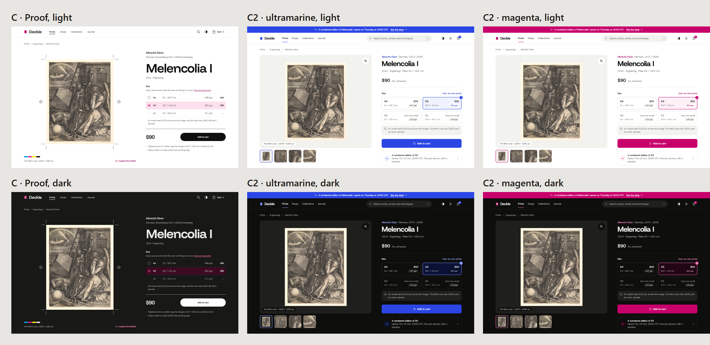
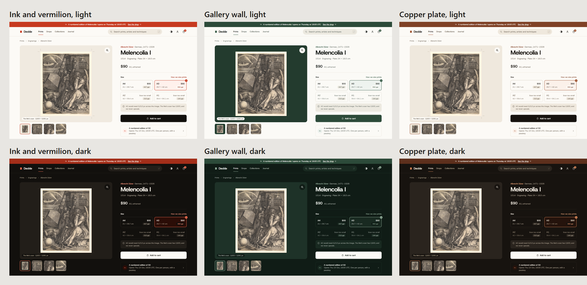

# Art direction

Three directions for the artwork page, drawn from how prints are made. The page and its markup are the same in all three; what changes is the token set, plus one motif each direction draws on the sheet.

| Direction | From | Palette | Type |
| --- | --- | --- | --- |
| A · Plate mark | Intaglio: the bevel a copper plate presses into damp paper | Rag paper, bistre ink, copper | Ibarra Real Nova and Hanken Grotesk |
| B · Kento | Woodblock: the corner and straight cuts that register the sheet | Kozo paper, sumi ink, Prussian blue, a vermilion seal | Young Serif and Murecho |
| C · Proof | A contemporary proof sheet: trim marks, registration targets, a colour bar | Bright stock, graphite, process magenta | Funnel Display and Funnel Sans |

C was the owner's pick, with one note: it did not yet look like a shop of today. **C2** rebuilds the same page as a contemporary store on the same token architecture: one grotesk (Host Grotesk), a neutral system with a single accent, a gallery with detail views, sizes as tiles, a drop panel with a countdown and the fifty copies drawn out, and the proof's trim marks kept faint. It comes in two accents, ultramarine and magenta, which are two token sets for one page (`modern.html?d=c2-ultramarine` or `c2-magenta`).

A plain accent connects nobody to the shop, so C2 was then coloured three ways from the trade itself (`modern.html?d=c2-vermilion`, `c2-gallery` or `c2-copper`):

| Palette | The story | How it is used |
| --- | --- | --- |
| Ink and vermilion | Black and red, the two colours printing began with | The interface is ink on paper; red marks only what is numbered, limited or about to open, as a printer's seal would |
| Gallery wall | The deep green of the rooms old masters hang in | Every work is shown on the wall before it is bought, and the dark theme is the gallery at night |
| Copper plate | The copper an engraving is cut into, on rag paper with bistre ink | Copper marks what is precious: the edition, the chosen size, the drop |

On 6 October 2026 the owner chose **Copper plate**. Its token set is now `packages/tokens`, and this folder stays as the record of the choice.

## Looking at them

Open `index.html` in a browser for all three side by side, or `artwork.html?d=kento&theme=dark` for one. The comparison sheets in `shots/` come from `pnpm --filter @deckle/art-direction capture`.

## Tokens

Each direction is a folder of DTCG files in `tokens/`, laid out the way Figma exports variables, one file per collection and mode:

- `primitives.tokens.json`: palettes, type families and scale, space, radius, stroke widths, motion, grid and breakpoints
- `semantic.light.tokens.json` and `semantic.dark.tokens.json`: colour by role (surface, text, icon, stroke, action, accent, feedback, focus) and the component tokens a motif needs, each an alias of a primitive
- `roles.tokens.json`: the type roles (display, heading 1 to 3, body, body small, caption, label and the edition numeral), and space, radius and motion by use

`build-tokens.mjs` turns them into CSS custom properties: primitives as `--p-*`, which only the semantic layer reads, and each colour role as a `light-dark()` pair. The chosen direction's files become the design system's source, built by Style Dictionary.

Every work shown is from The Met's Open Access collection (CC0). The fonts are under the SIL Open Font License and served from `assets/fonts`.
