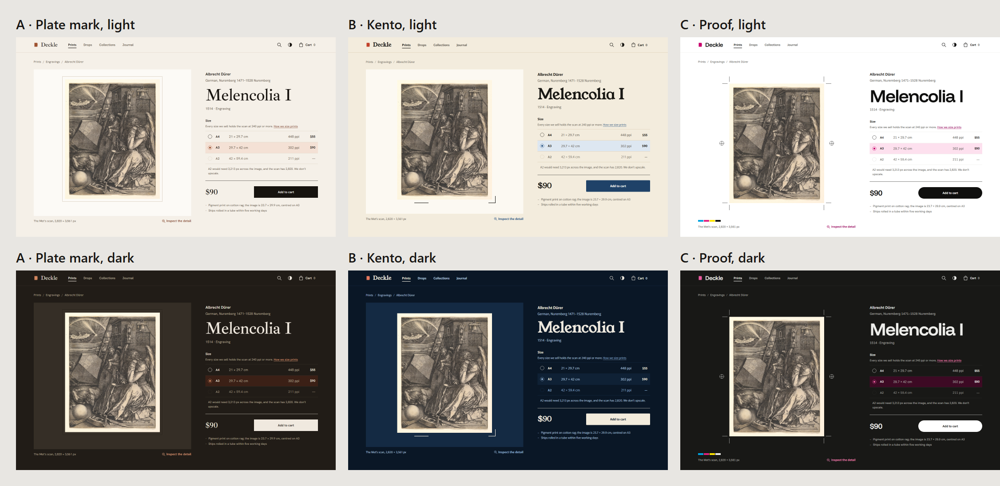

# Art direction

Three directions for the artwork page, drawn from how prints are made. The page and its markup are the same in all three; what changes is the token set, plus one motif each direction draws on the sheet.

| Direction | From | Palette | Type |
| --- | --- | --- | --- |
| A · Plate mark | Intaglio: the bevel a copper plate presses into damp paper | Rag paper, bistre ink, copper | Ibarra Real Nova and Hanken Grotesk |
| B · Kento | Woodblock: the corner and straight cuts that register the sheet | Kozo paper, sumi ink, Prussian blue, a vermilion seal | Young Serif and Murecho |
| C · Proof | A contemporary proof sheet: trim marks, registration targets, a colour bar | Bright stock, graphite, process magenta | Funnel Display and Funnel Sans |

## Looking at them

Open `index.html` in a browser for all three side by side, or `artwork.html?d=kento&theme=dark` for one. The comparison sheets in `shots/` come from `pnpm --filter @deckle/art-direction capture`.

## Tokens

Each direction is a folder of DTCG files in `tokens/`, laid out the way Figma exports variables, one file per collection and mode:

- `primitives.tokens.json`: palettes, type families and scale, space, radius, stroke widths, motion, grid and breakpoints
- `semantic.light.tokens.json` and `semantic.dark.tokens.json`: colour by role (surface, text, icon, stroke, action, accent, feedback, focus) and the component tokens a motif needs, each an alias of a primitive
- `roles.tokens.json`: the type roles (display, heading 1 to 3, body, body small, caption, label and the edition numeral), and space, radius and motion by use

`build-tokens.mjs` turns them into CSS custom properties: primitives as `--p-*`, which only the semantic layer reads, and each colour role as a `light-dark()` pair. The chosen direction's files become the design system's source, built by Style Dictionary.

Every work shown is from The Met's Open Access collection (CC0). The fonts are under the SIL Open Font License and served from `assets/fonts`.
