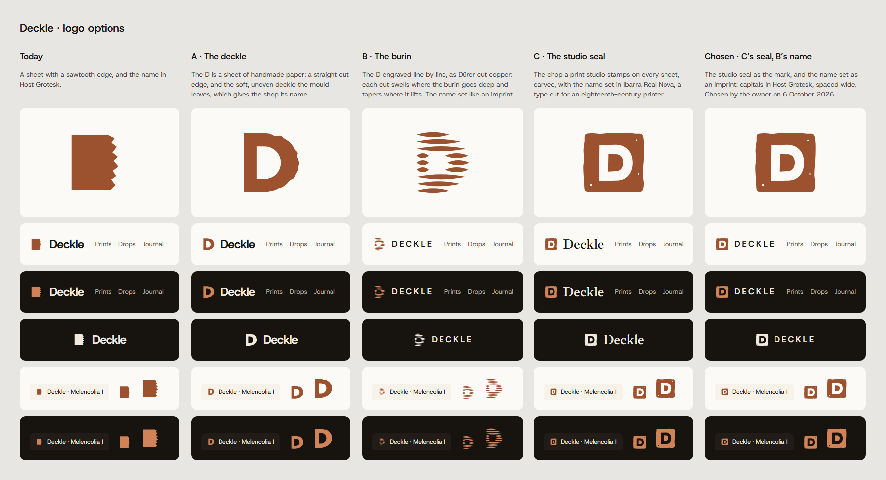

# Logo

How Deckle's mark was chosen, drawn from how prints are made, like the art direction beside it. `index.html` shows every option in the same places: large, in the header in both themes, in the footer, and as a favicon in a browser tab.

| Option | From | Name set in |
| --- | --- | --- |
| Today | A sheet with a sawtooth edge, the first sketch | Host Grotesk, bold |
| A · The deckle | The D as a sheet of handmade paper: a straight cut edge, and the soft, uneven deckle a paper mould leaves | Host Grotesk, bold |
| B · The burin | The D engraved line by line, each cut swelling where the burin goes deep and tapering where it lifts | Host Grotesk capitals, spaced as an imprint |
| C · The studio seal | The chop a print studio stamps on every sheet it prints, carved by hand, with specks where the ink did not take | Ibarra Real Nova |

On 6 October 2026 the owner chose **C's seal with B's name**: the seal as the mark, and the name in Host Grotesk capitals, spaced wide. The seal lives in `packages/ui/src/brand/seal.ts`, shared by the icon set and the favicon, which `pnpm --filter @deckle/ui favicon` writes in the accent copper of both themes.

Open `index.html` in a browser after `pnpm install`: it reads the built tokens from `packages/tokens/dist` and the fonts from the art direction's assets.
